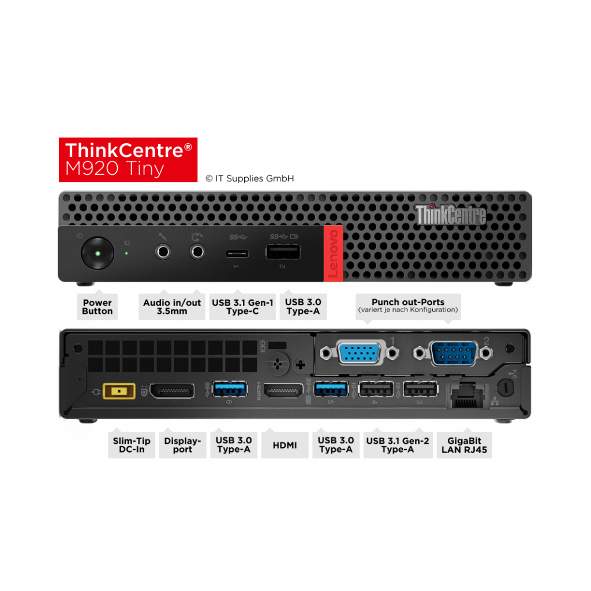

# Lenovo_M920Q_Hackintosh_Bigsur_OC

## 电脑配置

|   规格   |                           详细信息                           |
| :------: | :----------------------------------------------------------: |
| 电脑型号 |                      Lenovo M920Q Tiny                       |
| 操作系统 |                        macOS Big Sur                         |
|  处理器  |                    英特尔 酷睿 i5 - 9500T                     |
|   内存   |                             16GB                             |
|   硬盘   |                           WD SN750                           |
|   显卡   |                    Intel HD Graphics 630                     |
|  显示器  |                              无                              |
|   声卡   |                        Realtek ALC235                        |
|   网卡   |                              无                              |
|  BIOS版本|                           M1UKT5FA                           |

## 更新日志

- 01-06-2021
  - OpenCore `v0.6.5`
  - 支持`Big Sur`安装使用
  - 支持`DP` + `HDMI`双显
  - 声卡驱动完美，包括显示器音频输出功能正常
  - USB已定制，睡眠正常
  - 包含博通蓝牙驱动，未包含无线网卡驱动，请根据自己的需求安装相应驱动

### 设置`BIOS`

- 安全菜单：
  
  - 安全启动 -> `关闭`  (*Disable Secure Boot*)
  
- 设备：
  - 显示设备
    - 预指派内存大小：`64MB` (*DVMT* pre-allocated memory)
  
  - ATA设备菜单：
    - `配置SATA为` -> `AHCI`
  
- 其它参数默认即可

## 备注：

该配置文件默认CFG LOCK已解锁，请使用Tools中的CFGLock.efi进行CFGLock解锁操作：  
在OC的引导中按下空格，选CFGLock  
CFGLOCK.efi会自动找到CFG LOCK的参数，如Offset: 003E，值为1，1即可开启，输入Y，即可改为0，即关闭。然后重启即可。  
解锁完成后请使用VerifyMsrE2.efi进校验，建议每次修改BIOS设置后都校验一次，如果解锁失效请重新进行解锁  
需要注意的是，如果BIOS恢复出厂默认、更新BIOS版本、OC的RESET NVRAM指令，都会需使CFG LOCK修改恢复，这时需要再用CFGLOCK.efi修改一次。
## 接口说明

-USB安装如图所示位置进行定制，蓝牙已内建  
-我的设备只包含一个DP接口和一个HDMI接口，如果你是定制版本的M920Q包含多个DP/HDMI接口  
 请使用默认的DP/HDMI接口进行安装，否则可能无显示输出

##下载地址
https://github.com/yuppiesnotzhuhao/Lenovo_M920Q_Hackintosh_Bigsur_OC/releases
